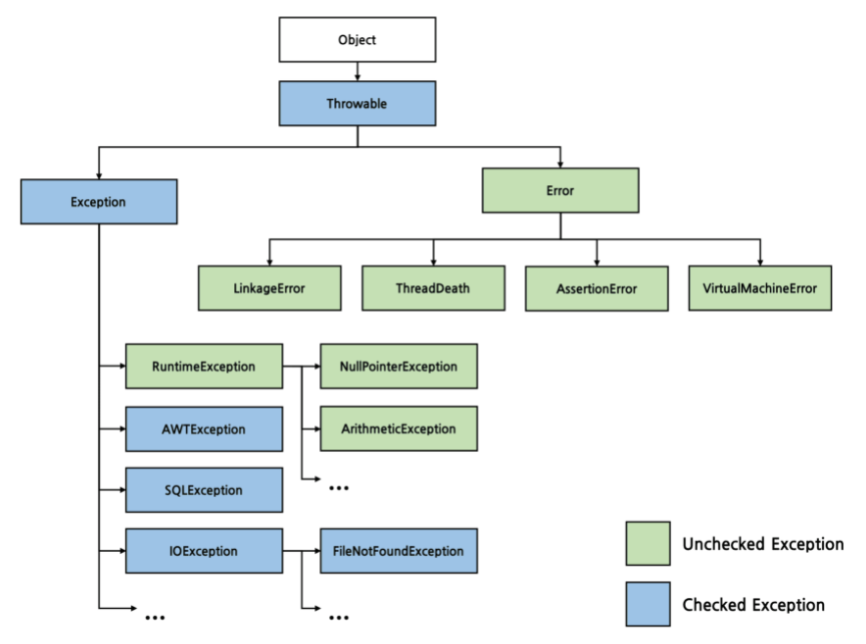

## 예외(Exception)
개발자가 구현한 로직에서 발생한다. 즉, 예외는 발생할 상황을 미리 예측하여 처리할 수 있다.

## 에러(Error)
시스템에 비정상적인 상황이 생겼을 때 발생한다. 시스템 레벨에서 발생하기 때문에 심각한 수준의 오류이다. 주로 자바 가상머신에서 발생시키는 것이며 애플리케이션 코드에서 잡을 수 없다.

## Unchecked Exception
런타임 시점에 확인된다. 명시적인 예외처리를 강제하지 않는다. 

## Checked Exception
컴파일 시점에 확인된다. 예외처리를 강제한다. `Checked Exception`이 발생할 가능성이 있으면 반드시 `try-catch`로 예외를 잡거나 `throw`로 호출한 메소드에 예외를 던져야한다.

## Checked Exception 처리 방법
예외 복구, 예외처리 회피, 예외 전환

## 정리
### 예외 복구 전략이 명확하고 복구 가능하다면 `Checked Exception`을 `try-catch`로 잡아서 예외를 복구하거나, 코드의 흐름으로 제어하는 것이 좋다.
### 그러나 이러한 경우는 흔하지 않기 때문에 `Checked Exception`이 발생하면 더 구체적인 `UnChecked Exception`을 발생시키고 예외에 대한 메시지를 명확하게 전달하는 것이 효과적이다.
### 무책임하게 상위 메서드에 `throw`로 예외를 던지는 행위를 하지 않는 것이 좋다. 상위 메서드들의 책임이 그만큼 증가하기 때문이다.

## 고민한 부분
### API 예외는 어떻게 처리하는게 좋을지
### 오류/정상 응답을 어떤 포맷으로 클라이언트에 내려주는 게 좋을지
나는 도메인 별로 예외를 정의해서 써본 경험이 없었다. 그래서 예외 처리의 여러 방법에 대해 찾아보고 알게 되었지만 결국엔 그나마 제일 익숙한 방식을 택했다.(RuntimeException을 상속받은 BusinessException 정의해서 상세 오류 코드와 메시지를 전달하는 정도였다.) 이번 프로젝트에는 예외에 대해 좀 더 명확하고 공통적으로 처리될 수 있도록 고민해보고 적용해 봐야겠다. 그리고 후기를 여기에 업데이트해 보면 좋을 것 같다.

## 참고
- [https://github.com/cheese10yun/spring-guide/blob/master/docs/exception-guide.md#exception-guide](https://github.com/cheese10yun/spring-guide/blob/master/docs/exception-guide.md#exception-guide)
- [https://cheese10yun.github.io/checked-exception/](https://cheese10yun.github.io/checked-exception/)
- [https://steady-coding.tistory.com/583](https://steady-coding.tistory.com/583)